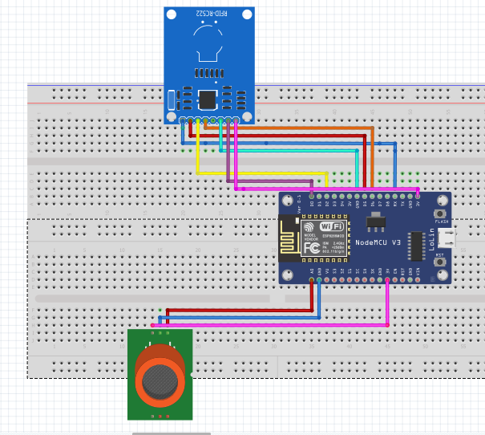
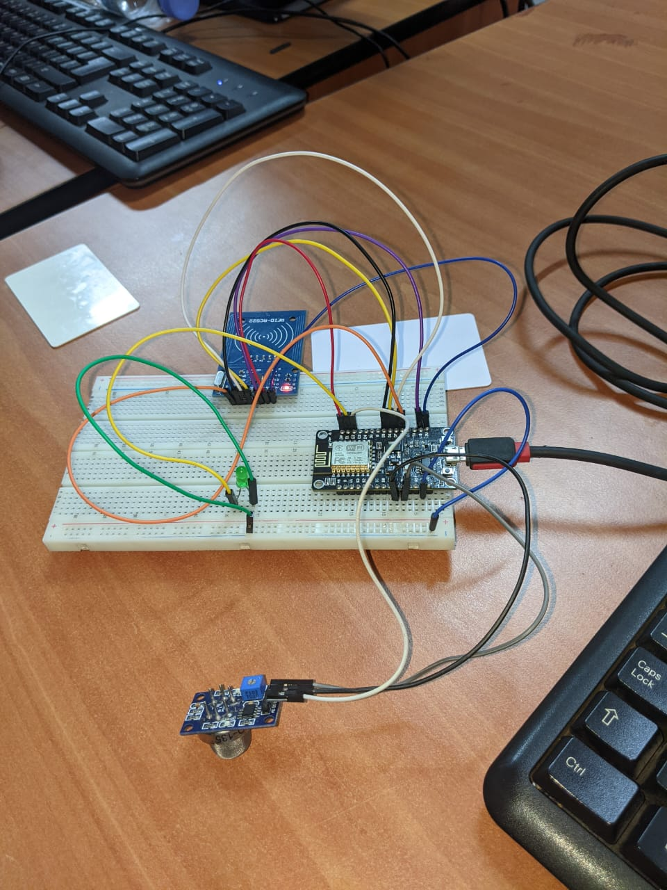

# Project : Access monitor using RFDI technology

## Aim of the project  
Our system would allow authorized personnel to gain entry to the room, while preventing unauthorized individuals from accessing it.To achieve this, the system would utilize RFID tags that are assigned to authorized personnel. These tags would be read by an RFID reader when a person attempts to gain entry to the room.

The use of the MQ-135 sensor with NodeMCU ESP8266 allows for real-time monitoring of gas levels, which can help prevent dangerous situations and protect human health.

## Circuit diagram
<div align="left">
<a href="https://github.com/VickyChris/Managing-access-rights-using-rfid-technology">
    
  </a>
  </div>

## Circuit connexion
<div align="left">
<a href="https://github.com/VickyChris/Managing-access-rights-using-rfid-technology">
    
</a>
</div>

## Installation
1. To download the <a href="https://nodemcu.readthedocs.io/en/release/"><strong>NodeMCU ESP8266</strong></a> library
  
   * Open the Arduino IDE and go to "Sketch" > "Include Library" > "Manage Libraries".
   * In the Library Manager, search for "ESP8266" and you should see a list of available libraries.
   * Look for the "esp8266" library, which is the official library from the NodeMCU team, and click on "Install".
   * Wait for the installation process to finish, and you should see a confirmation message when it's done.

2. To add the additional board for ESP8266 in Arduino IDE
   * Open the Arduino IDE and go to "File" > "Preferences".
   * In the "Additional Boards Manager URLs" field, add the following URL: 
   ```
   http://arduino.esp8266.com/stable/package_esp8266com_index.json
    ```
   * Click on "OK" to save the changes and close the Preferences window.
   * Go to "Tools" > "Board" > "Boards Manager".
   * In the Boards Manager, search for "ESP8266" and you should see an option for "esp8266 by ESP8266 Community".
   * Click on "Install" to install the board package.
   * Wait for the installation process to finish, and you should see a confirmation message when it's done.
Now you can select the ESP8266 board from the "Tools" > "Board" menu and start programming.

1. <a href="https://www.arduinolibraries.info/libraries/mq135"><strong>Download RFID RC522 library</strong></a>

   * Open the Arduino IDE and go to "Sketch" > "Include Library" > "Manage Libraries".
   * In the Library Manager, search for "RFDI RC522" and you should see a list of available libraries.
   * click on "Install".
   * Wait for the installation process to finish, and you should see a confirmation message when it's done.
2. <a href="https://www.arduinolibraries.info/libraries/mq135"><strong>Download MQ135 Gaz Sensor library</strong></a> 
    * Open the Arduino IDE and go to "Sketch" > "Include Library" > "Manage Libraries".
   * In the Library Manager, search for "MQ 135 Gaz sensor" and you should see a list of available libraries.
   * click on "Install".
   * Wait for the installation process to finish, and you should see a confirmation message when it's done.
3. <a href="https://thingspeak.com/"><strong>Thingspeak library</strong></a> 
   
      * Open the Arduino IDE and go to "Sketch" > "Include Library" > "Manage Libraries".
      * In the Library Manager, search for "Thingspeak" and you should see a list of available libraries.
      * click on "Install".
      * Wait for the installation process to finish, and you should see a confirmation message when it's done.
  1. WiFiClient library
       * Open the Arduino IDE and go to "Sketch" > "Include Library" > "Manage Libraries".
       * In the Library Manager, search for "WiFiClient" and you should see a list of available libraries.
       * click on "Install".
       * Wait for the installation process to finish, and you should see a confirmation message when it's done.

## To Send data to <a href="https://thingspeak.com/"><strong>Thingspeak</strong></a> Cloud

1. Create a ThingSpeak account and create a new channel to store your data. Note down the Channel ID and the Write API Key, as you will need these later.
2. In your Arduino sketch, include the following libraries:
 ```
  #include <ESP8266WiFi.h>
  #include <WiFiClient.h>
  #include <ThingSpeak.h>
 ```
3. Set up your Wi-Fi connection by providing your SSID and password:
```
const char* ssid = "YourWiFiSSID";
const char* password = "YourWiFiPassword";
WiFi.begin(ssid, password);
while (WiFi.status() != WL_CONNECTED) {
  delay(1000);
}
 ```
 4. Initialize the ThingSpeak library and set the Channel ID and Write API Key:
```
WiFiClient client;
unsigned long myChannelNumber = 12345; // Replace with your Channel ID
const char * myWriteAPIKey = "YourWriteAPIKey"; // Replace with your Write API Key
ThingSpeak.begin(client);
ThingSpeak.setField(1, value); // Replace "value" with your actual data value
 ```
 5. To send your data to the ThingSpeak cloud:
```
ThingSpeak.writeFields() 

int x = ThingSpeak.writeFields(myChannelNumber, myWriteAPIKey);
if (x == 200) {
  Serial.println("Channel update successful.");
} else {
  Serial.println("Error code " + String(x));
}
```
6. Upload your sketch to the NodeMCU esp8266 board and monitor the serial output to ensure that your data is being sent successfully.

## Contact
twitter: - [vitaltakachris1](https://twitter.com/vitaltakachris1) 

Project Link: -  [https://github.com/VickyChris/Managing-access-rights-using-rfid-technology](https://github.com/VickyChris/Managing-access-rights-using-rfid-technology)


